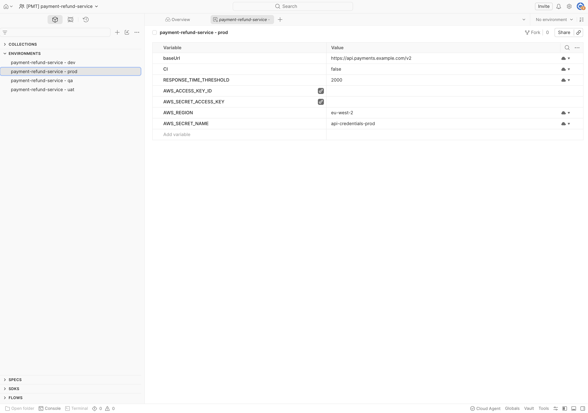

# jr-cse-payments-postman-onboarding

Postman API onboarding workflow for the **Payment Refund** service. Primary
working implementation for the Postman CSE take-home exercise.

Companion repo (adaptation analysis): **loan-origination-postman-onboarding**.

> **Status:** Workflow verified working end-to-end against the open-alpha
> `postman-cs/postman-api-onboarding-action@v0`. Four sections marked
> `<!-- TODO -->` need observed values once the workflow has run in your
> environment. See `SETUP.md` for the verified setup path (~20 minutes) and
> `BLUEPRINT.md` / `PROMPTS.md` for the iterative build approach.

---

## 1. Overview

This repo onboards the Payment Refund API into Postman through a single GitHub
Actions workflow (`.github/workflows/onboard.yml`) that calls the open-alpha
orchestrator action. One push triggers the entire chain — workspace creation,
spec upload, collection generation, environment setup, mock and monitor
creation, and a commit-back of the generated artifacts.

Two repo-level secrets and a customer-side fallback token drive the workflow;
two repo variables hold identity values that would otherwise be hardcoded.

## 2. Services Onboarded

- **Payments (Refund API)** — this repo. Lambda + API Gateway compute, OAuth 2.0 + JWT auth declared in spec.
- **Loan Origination** — companion repo `loan-origination-postman-onboarding`. Demonstrates pattern transfer to ECS+ALB compute and JWT auth (mTLS handled via the action's `ssl-client-*` inputs as customer-side cert provisioning).

## 3. Repository Structure

```
jr-cse-payments-postman-onboarding/
├── .github/workflows/
│   ├── onboard.yml             # the onboarding workflow (this is the implementation)
│   └── payments-tests.yml      # generated by the action; runs collections on schedule
├── specs/
│   └── payment-refund-api-openapi.yaml
├── postman/
│   └── collections/            # JSON exports committed by the action's repo-sync phase
│       ├── [Baseline] payment-refund-service.json
│       ├── [Contract] payment-refund-service.json
│       └── [Smoke] payment-refund-service.json
├── docs/screenshots/           # validation evidence (see §9)
├── service.config.yml          # per-service inputs documented (no secrets)
├── issues-log.md               # honest build log — iterations, errors, fixes
├── SETUP.md                    # verified ~20-minute setup path
├── CLAUDE.md / BLUEPRINT.md / PROMPTS.md   # build operating docs
└── VERIFIED-NOTES.md           # facts confirmed against the live action.yml
```

## 4. Workflow Architecture

The action chain works in three phases:

1. **`postman-api-onboarding-action@v0`** orchestrates two lower-level actions and
   resolves identity inputs (workspace admin user, requester email, domain code).
2. **Bootstrap phase** — calls Postman APIs to create the workspace, upload the
   spec to Spec Hub, generate baseline/smoke/contract collections from the spec,
   configure environments per the `environments-json` input, create a mock
   server, and create a monitor.
3. **Repo-sync phase** — exports the generated collections to
   `postman/collections/`, commits them back to `main` (using the
   `gh-fallback-token` PAT — not the default `GITHUB_TOKEN`, which can't write
   to `.github/workflows/` by design), and writes the generated CI test workflow
   (`payments-tests.yml`).

Five inputs feed into this — three from secrets, two from variables:

| Source | Name | Purpose |
|---|---|---|
| Secret | `POSTMAN_API_KEY` | Long-lived PMAK (Postman web UI → Settings) |
| Secret | `POSTMAN_ACCESS_TOKEN` | Session-scoped token extracted from `~/.postman/postmanrc` after `postman login` — required for Bifrost git-sync, governance, and system-env steps |
| Secret | `GH_FALLBACK_TOKEN` | Fine-grained PAT with Contents/Workflows/Actions/Variables write — required because default `GITHUB_TOKEN` can't write to `.github/workflows/` |
| Variable | `REQUESTER_EMAIL` | Workspace audit metadata |
| Variable | `POSTMAN_USER_ID` | Numeric Postman user ID for workspace admin assignment |

## 5. Universal Pattern vs Per-Service Differences

The pattern that's identical across services:

| Aspect | Universal? |
|---|---|
| Action chain (`postman-api-onboarding-action@v0`) | ✓ Same orchestrator |
| Permissions block (`actions: write`, `contents: write`) | ✓ Same |
| Secret references (POSTMAN_API_KEY, POSTMAN_ACCESS_TOKEN, GH_FALLBACK_TOKEN) | ✓ Same |
| GitHub token wiring (`github-token`, `gh-fallback-token`) | ✓ Same |
| `generate-ci-workflow: true` for continuous coverage | ✓ Same |
| Workflow file structure | ✓ Same |
| Validation pattern (six UI checks) | ✓ Same |

What varies per service:

| Aspect | Payments | Loan Origination |
|---|---|---|
| `project-name` | `payment-refund-service` | `loan-origination-service` |
| `domain` / `domain-code` | `payments` / `PMT` | `lending` / `LND` |
| `spec-path` / `spec-url` | Points at payments spec | Points at loan-origination spec |
| `environments-json` | `["prod","uat","qa","dev"]` (4) | `["prod","staging","dev"]` (3) |
| `env-runtime-urls-json` | payments.example.com URLs | lending-api.example.com URLs |
| `ci-workflow-path` | `payments-tests.yml` | `loan-origination-tests.yml` |

That's roughly 6-8 input lines of difference between the two workflows. See
`ADAPTATION.md` in the loan-origination repo for the actual measured diff.

## 6. What Generated Checks Validate vs What Still Needs Service-Specific Knowledge

The three collections (baseline, smoke, contract) are generated from the
OpenAPI spec, so they validate:

- Request/response **shapes** match the OpenAPI contract
- Required parameters are present and correctly typed
- Documented status codes are reachable on the mock server
- The spec-declared auth scheme (`securitySchemes`) is wired into requests
- Path parameters and query filter shapes match what the spec promises

They do **not** validate:

- Real auth against the actual backend — a PMAK cannot mint OAuth tokens for
  the Payment Refund service itself
- **Business rules that live in spec prose, not as enforceable constraints** —
  e.g., the Refund API's 180-day refund window and per-transaction refund
  limits appear in the spec's `description` fields but aren't expressible as
  JSON Schema constraints. Bespoke contract tests would be needed.
- Cross-service workflows (refund-then-reconcile is a flow involving multiple
  services, not a single-API contract)
- Performance characteristics and load behavior
- Production-only auth integrations (real OAuth providers, mTLS client certs)

This is the right behavior — the action's job is to bootstrap the catalog,
not to replace integration testing.

## 7. Customer-Side Requirements (what the platform team must provide)

1. **Environment URLs per service per env** (dev/staging/prod). The
   `example.com` URLs in this repo come from the brief's specs and need to be
   replaced with real internal URLs.
2. **Auth secret names + provisioning in their secret manager.** For OAuth 2.0,
   client ID and secret. For JWT, signing keys or token-issuance endpoint.
3. **A fine-grained Personal Access Token (or GitHub App)** with `Contents:
   write` and `Workflows: write` on each onboarding repo, surfaced as a repo
   or org secret named `GH_FALLBACK_TOKEN`. Required because the default
   `GITHUB_TOKEN` cannot write to `.github/workflows/` (supply-chain
   protection); the action's `gh-fallback-token` input is the documented
   mechanism for materializing the generated CI test workflow.
4. **CI/CD runner availability.** GitHub Actions runners for most teams. For
   the GitLab CI team mentioned in the brief, the underlying CLIs
   (`postman-bootstrap-action`, `postman-repo-sync-action`) are installable
   via npm and run identically — only the workflow wrapper differs.
5. **Source-IP allowlisting for Postman monitors** hitting network-restricted
   services (especially mTLS endpoints).
6. **Service ownership tags** so onboarded workspaces have known owners for
   governance audits.
7. **Spec-authoring effort** for services without specs — see the Adaptation
   slide in the deck for the traffic-capture / introspection / facilitated-writing
   options.

## 8. Run Instructions

See `SETUP.md` for full first-run setup (~20 minutes from a clean Mac).

Once secrets and variables are configured:

```bash
gh workflow run onboard.yml --repo <OWNER>/jr-cse-payments-postman-onboarding
gh run watch "$(gh run list --repo <OWNER>/jr-cse-payments-postman-onboarding --workflow=onboard.yml --limit 1 --json databaseId --jq '.[0].databaseId')"
```

Then validate the six Postman UI checks per `SETUP.md` Step 7. A green
workflow is necessary but not sufficient — the `POSTMAN_ACCESS_TOKEN` can
silently expire and leave the workspace half-built, so visual verification
is required.

## 9. Validation Evidence

<!-- TODO: after a clean run, replace this block with: -->

<!--
- **Latest green workflow run:** https://github.com/<OWNER>/jr-cse-payments-postman-onboarding/actions/runs/<RUN_ID>
- **Committed collections:** see [`postman/collections/`](postman/collections/)
- **Generated CI workflow:** see [`.github/workflows/payments-tests.yml`](.github/workflows/payments-tests.yml)

Screenshots from the validated workspace:




-->

## 10. Rerun / Idempotency Behavior

The action persists workspace, spec, and collection IDs as GitHub repo
variables on its first successful run, then reads those variables on
subsequent runs to reuse the existing assets rather than creating duplicates.

<!-- TODO: after running the workflow at least twice, replace with observed behavior:

Observed in this repo:
- Re-running the workflow with no changes — same workspace, same collection IDs,
  same monitor; no duplication. The action updated metadata in place.
- Editing the spec (e.g., bumping `info.version`) and re-running — same
  workspace, same collection IDs, collections regenerated from the updated
  spec, monitor unchanged.

⚠️ **Edge case observed during initial build:** When the workflow fails before
the persist step (e.g., the four iterations required to get the first green
run — see `issues-log.md`), each failed run can create a fresh set of artifacts.
After the first green run, idempotency kicks in. If you see duplicate
collections in the workspace, clean them up in the Postman UI; subsequent
runs won't duplicate.
-->

## 11. Known Issues and Resolutions

Four iterations were needed to get the first green run on this scaffold. Each
exposed a real discrepancy between the action's declared contract and its
runtime behavior — documented honestly in `issues-log.md`:

1. **`variables: write` is not a valid GitHub Actions permission key.**
   The job-level `permissions:` block has a fixed allow-list; `variables`
   isn't in it. Repo variables are written via the GitHub API using
   `GITHUB_TOKEN`'s standard scopes, not a job permission. Fix: remove the
   line.

2. **`spec-url` is required despite `action.yml` declaring it optional.**
   The orchestrator's `action.yml` says "provide either `spec-url` or
   `spec-path`," but the underlying `postman-bootstrap-action@v0` requires
   `spec-url` at runtime. Fix: provide both inputs.

3. **Default `GITHUB_TOKEN` cannot write to `.github/workflows/`.** This is
   by design (supply-chain protection). The action's `gh-fallback-token`
   input exists for exactly this case. Fix: create a fine-grained PAT with
   Workflows write, wire it via `gh-fallback-token`.

4. **PAT must be verified before saving as a secret.** A truncated or
   mistyped PAT fails silently — the workflow run reports a 403 with no
   clear cause. Fix: always test the PAT against
   `GET https://api.github.com/user` and the target repo's `permissions.push`
   before setting the secret.

**Pattern across all four:** open-alpha tooling has loose `action.yml`
validation but stricter runtime requirements in the chained downstream
actions. The reliable verification is running it; the unreliable one is
trusting the declared contract.

## 12. Trade-offs

What I'd do differently with more time:

- **Author bespoke contract tests for the documented business rules.** The
  180-day refund window and per-transaction refund limits live in spec prose
  only; today's generated collections don't enforce them. A custom Postman
  test script per critical rule would close that gap.
- **Validate the GitLab CI port end-to-end.** The CLIs are documented to work
  identically; ~half a day to confirm in a personal GitLab instance.
- **Build the org-mode path.** The workflow has commented `org-mode: true` /
  `workspace-team-id` lines for org-scoped Postman teams. My team isn't
  org-mode, so I haven't exercised that code path.
- **Add a workspace cleanup workflow.** Today, failed runs can leave duplicate
  collections that have to be cleaned manually. A cleanup script would help.

## 13. Scaling Considerations

The pilot scope is 50 services across one platform team. The pattern scales
because:

- The workflow file is structurally identical across services (~6-8 input
  lines change between services with very different compute and auth — see
  `ADAPTATION.md` in the companion repo)
- The action persists state in repo variables, so re-runs are idempotent
- Customer-side requirements (§7) are knowable upfront, so cohort planning
  reduces to bucketing services by spec freshness + auth pattern + CI platform

The 90-day cohort roadmap and ROI model live in the presentation deck
(outside this repo). Headline: pilot proves the pattern; org-wide rollout
to ~300 services makes the catalog real; the catalog unlocks Agent Mode
queries and dependency graphs.

## 14. AI Assistance and Manual Validation

### What AI generated
- Initial draft of `.github/workflows/onboard.yml`, including the job
  structure, permissions block, and the `uses:` line for the orchestrator.
  Tool: Claude.
- The `env-runtime-urls-json` JSON value, populated from the spec's `servers`
  block.
- Initial draft of this README's structure and most prose.
- The `service.config.yml` documentation file.

### What I validated manually
- Read `action.yml` for `postman-api-onboarding-action@v0` directly in the
  upstream repo at commit time. Verified against the input schema.
- Ran the workflow against a real Postman workspace; confirmed each artifact
  appeared in the UI through the six checks in `SETUP.md` Step 7.
- Tested re-run behavior to confirm idempotency.
- Diffed Claude's draft of the loan workflow against this one to confirm only
  the per-service inputs differed (see `ADAPTATION.md` in the companion repo).
- Verified the PAT against `https://api.github.com/user` and the specific repo's
  `permissions.push` field before saving it as a secret — this caught one
  silently-truncated paste.

### What AI got wrong (and I corrected)
- **AI added `variables: write` to the job permissions block.** GitHub Actions
  has a fixed allow-list of permission keys; `variables` isn't one. Caught on
  the first `gh workflow run` with HTTP 422 "Unexpected value 'variables'."
  Fix: removed the line. Logged in `issues-log.md` 2026-05-28 entry #1.
- **AI used `spec-path` alone and dropped `spec-url`.** Despite the
  orchestrator's `action.yml` declaring both as optional, the downstream
  `postman-bootstrap-action@v0` requires `spec-url` at runtime. Caught on the
  second run with "Input required and not supplied: spec-url." Fix: added
  `spec-url` while keeping `spec-path`. Logged in entry #2.
- **AI omitted `gh-fallback-token` entirely.** The action's documented escape
  hatch for `.github/workflows/` writes was missing from the initial draft.
  Caught on the third run with a 422 "without `workflows` permission" error
  during the commit-back step. Fix: created a fine-grained PAT with
  Contents/Workflows/Actions/Variables write, wired it via
  `gh-fallback-token`. Logged in entry #3.
- **AI claimed `ci-workflow-path` default was `onboard.yml`** (collision risk).
  Real default per `action.yml` is `.github/workflows/ci.yml` — no collision
  risk with `onboard.yml`. Documented in `VERIFIED-NOTES.md`.
- **AI claimed `v0.x.y` immutable tags exist** for pinning. Real state: only
  `@v0` rolling exists; no immutable tags are published yet. Documented in
  `VERIFIED-NOTES.md`. Used `@v0`.

### Why this matters
AI accelerated drafting by maybe 5x and was useful for the prose and the
non-load-bearing scaffolding. On the load-bearing pieces — the workflow file
itself, the action contract — it confidently invented inputs that don't exist
and dropped inputs that do. Every load-bearing claim was verified against the
upstream `action.yml` or against a real run. The pattern: **AI does first
drafts; humans verify against authoritative sources; both contributions are
documented honestly.** Open-alpha tooling makes this verification especially
important because the declared contract (`action.yml` README) lags behind
the runtime contract (what the chained downstream actions require).

## References

- **Brief:** https://github.com/postman-cs/cse-exercise
- **Orchestrator action:** https://github.com/postman-cs/postman-api-onboarding-action
- **Postman Learning Center:** https://learning.postman.com/
- **Postman API authentication:** https://learning.postman.com/docs/developer/postman-api/authentication/
