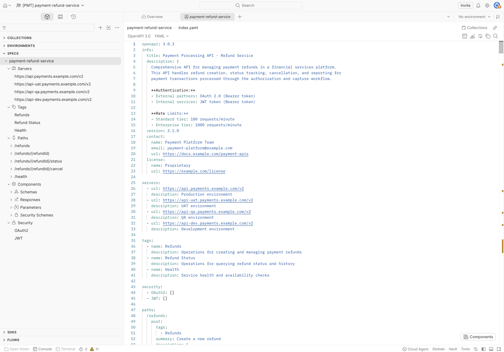
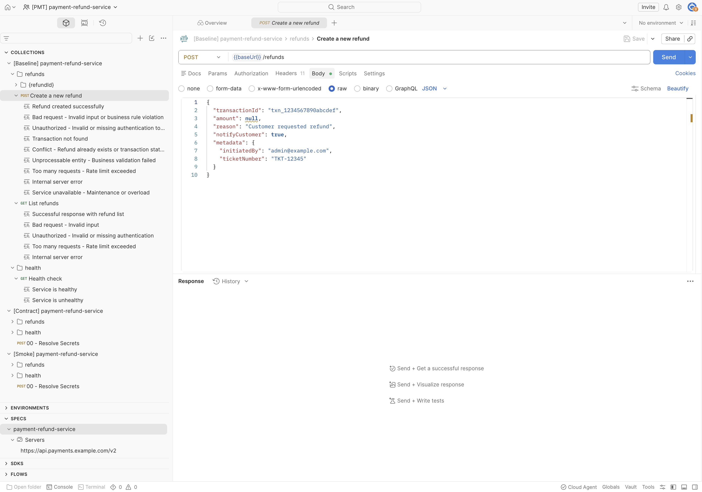
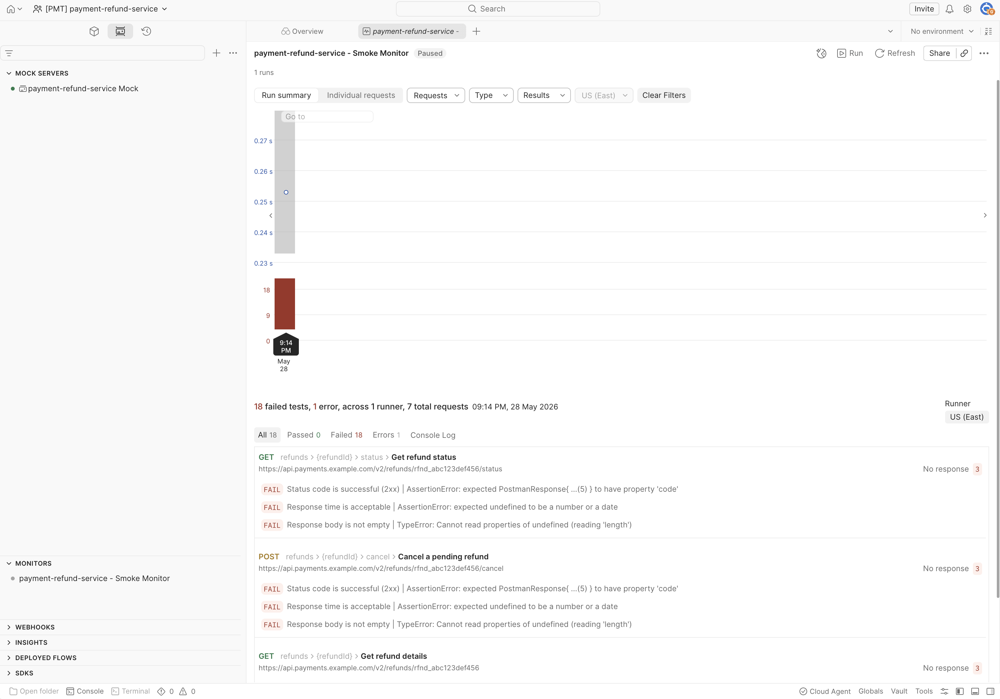

# Validation Evidence — Payments Service

Five screenshots from the `[PMT] payment-refund-service` Postman workspace,
showing the open-alpha onboarding action's end-to-end result: workspace,
spec, baseline collection (with realistic business-rule example responses),
four environments, and a monitor that exercised the catalog.

All artifacts were generated by a single `gh workflow run` against
`postman-cs/postman-api-onboarding-action@v0`. No manual workspace
construction. See `README.md §9` for surrounding narrative.

> **This is the canonical pattern.** The companion repo
> (`jr-cse-loan-origination-postman-onboarding`) shows the same shape applied
> to a different service — different compute, different declared auth,
> different environment count. The diff between the two onboarding workflows
> is `ADAPTATION.md` rendered.

---

## 1. Workspace home + collection structure + populated request body

![Baseline collection — POST /refunds with populated request body showing transactionId, amount, reason, metadata in [PMT] workspace](screenshots/Workspace-home.png)

The `[PMT] payment-refund-service` workspace contains the three
spec-derived collections the action produces — `[Baseline]`, `[Contract]`,
`[Smoke]` — each with the same logical request structure derived from the
OpenAPI spec's paths:

- `refunds/` — `Create a new refund`, `List refunds`
- `refunds/{refundId}/` — get details, status, cancel (under nested folders)
- `health/` — `Health check`

The Baseline collection is expanded. Each leaf request has multiple example
responses pre-populated — for `Create a new refund` (POST `/refunds`),
seven example responses cover the full spectrum: success (201), bad
request (400), unauthorized (401), not found (404), conflict (409),
unprocessable entity (422), rate limit (429), and 5xx errors. The right
pane shows the **request body** as a populated JSON payload:

```json
{
  "transactionId": "txn_1234567890abcdef",
  "amount": null,
  "reason": "Customer requested refund",
  "notifyCustomer": true,
  "metadata": {
    "initiatedBy": "admin@example.com",
    "ticketNumber": "TKT-12345"
  }
}
```

This is a realistic-looking request body the action generated from the
spec's request schema — `transactionId` with a sensible example value,
`reason` as a human string, `metadata` as a structured nested object with
operational tracking fields. Not lorem-ipsum, not raw `string` placeholders
everywhere.

**What this proves:** the action read the spec, generated three
collections, structured them by tag, and populated requests with realistic
example bodies. The collections are callable, not skeletons.

---

## 2. Spec in Spec Hub — OAuth 2.0 + JWT, four servers, full component model



The Payment Refund OpenAPI spec is uploaded to Spec Hub and parses
correctly. The sidebar reveals the structure the action processed:

- **4 Servers** — `api.payments.example.com/v2` (prod / uat / qa / dev)
- **3 Tags** — `Refunds`, `Refund Status`, `Health`
- **5 Paths** — `/refunds`, `/refunds/{refundId}`, `/refunds/{refundId}/status`, `/refunds/{refundId}/cancel`, `/health`
- **Components** — `Schemas`, `Responses`, `Parameters`, `Security Schemes`
- **Security** — both `OAuth2` AND `JWT` (visible in left sidebar)

Important detail in the YAML — lines 9-11 and 43-45:

```yaml
**Authentication:**
- External partners: OAuth 2.0 (Bearer token)
- Internal services: JWT token (Bearer token)
...
security:
  - OAuth2: []
  - JWT: []
```

**Both auth mechanisms are formally declared in `securitySchemes` and
referenced in the top-level `security` block.** The generated collection
wires both. Contrast with the companion (Loan Origination), where the spec
declares only JWT in `securitySchemes` and mentions mTLS only in
description prose — that asymmetry surfaces as a real
adaptation-plan item there. Payments has the cleaner auth model:
spec-declared auth equals runtime auth, no customer-side prose-to-config
translation required.

**What this proves:** the catalog story works — the spec is discoverable
in Spec Hub, structurally lines up with the generated collections (tags →
folders, paths → request groups), and auth is fully captured in the
machine-readable layer of the spec. This is the cleanest case for
generated catalog onboarding.

---

## 3. Baseline collection — POST /refunds with business-rule validation response



This shot captures the `Bad request - Invalid input or business rule
violation` example response (HTTP 400) for `POST /refunds`. Showing a
negative-path example tells a richer story than a success response:

- **Method + URL**: `POST {{baseUrl}}/refunds`
- **Tabs**: `Headers 3` indicator dot, `Body` indicator dot — auth headers and request body are present
- **Status code**: `400 Bad Request`
- **Response body** is structured and business-meaningful:

```json
{
  "error": "INVALID_REFUND_AMOUNT",
  "message": "Refund amount exceeds the original transaction amount",
  "details": {
    "transactionId": "txn_1234567890abcdef",
    "originalAmount": 5000,
    "requestedRefundAmount": 6000,
    "currency": "USD"
  },
  "code": "VALIDATION_ERROR",
  "timestamp": "2024-01-15T10:30:00Z"
}
```

This is the **180-day refund window / per-transaction limit** business rule
made concrete — the spec captures it as a 400 response with a structured
error payload, and the action surfaces it as a callable example in the
baseline collection.

The trade-off worth noting (and called out in `README.md §6`): the spec's
prose describes the business rule, but the rule itself isn't an
enforceable JSON Schema constraint. The example response demonstrates
what a violation looks like — but a Postman test script can't enforce the
rule against an arbitrary backend response without knowing the original
transaction amount. **Bespoke contract tests would be the next layer of
work**, and they're scoped in `README.md §12` as a "what I'd do
differently with more time" item.

**What this proves:** generated collections include realistic, callable
requests with populated example responses covering happy paths AND
business-rule violations. The catalog captures more than CRUD; it captures
the documented operational semantics the spec encodes. The limits of what
the action handles vs. what bespoke contract tests would handle are
explicit, not hidden.

---

## 4. Four environments populated from spec servers block

![Four environments in [PMT] workspace — dev / prod / qa / uat — with prod selected showing baseUrl and AWS variables](screenshots/environments.png)

The sidebar shows **four environments** — `payment-refund-service - dev`,
`payment-refund-service - prod`, `payment-refund-service - qa`,
`payment-refund-service - uat` — matching the four URLs in the spec's
`servers` block. (The Loan Origination companion has three —
`prod`/`staging`/`dev` — because its spec declared three. Per-service
config in action.)

The `prod` environment is open in the right pane. Variables populated by
the action:

| Variable | Value | Notes |
|---|---|---|
| `baseUrl` | `https://api.payments.example.com/v2` | From the spec's `servers[0].url`. Real URL goes here customer-side. |
| `CI` | `false` | Run flag |
| `RESPONSE_TIME_THRESHOLD` | `2000` | Default monitor assertion threshold (ms) |
| `AWS_ACCESS_KEY_ID` | (secret placeholder) | Auth scaffolding |
| `AWS_SECRET_ACCESS_KEY` | (secret placeholder) | Auth scaffolding |
| `AWS_REGION` | `eu-west-2` | Region placeholder |
| `AWS_SECRET_NAME` | `api-credentials-prod` | Secret-manager reference |

The variable shape is identical to the Loan Origination workspace — same
secret-manager-shaped scaffolding regardless of service. That's the
**universal-vs-per-service pattern made visible at the environment layer**:
the count and URLs vary per service (config), but the variable schema is
universal (structure).

**What this proves:** environments are spec-driven (count + URL pattern
match the spec), variable names follow a consistent secret-manager pattern
that's identical across services, and the per-environment baseUrl matches
the env name. Customer-side work is filling in the secret values and
replacing `example.com` URLs with real internal hosts — a knowable, scoped
ask documented in `README.md §7`.

---

## 5. Monitor wired and exercising the catalog



The `payment-refund-service - Smoke Monitor` exists and ran on-demand.
One run executed; the run summary shows: **18 failed tests, 1 error,
across 1 runner, 7 total requests**, US (East) region, 09:14 PM 28 May
2026. Visible requests in the failure list:

- `GET /refunds/{refundId}/status` — Get refund status
- `POST /refunds/{refundId}/cancel` — Cancel a pending refund
- `GET /refunds/{refundId}` — Get refund details

All 18 assertions failed with a consistent error pattern:

```
FAIL  Status code is successful (2xx) | AssertionError: expected ...(5)... to have property 'code'
FAIL  Response time is acceptable    | AssertionError: expected undefined to be a number or a date
FAIL  Response body is not empty     | TypeError: Cannot read properties of undefined (reading 'length')
```

**The failure pattern itself is the evidence the wiring works.** Status
code 5xx + empty response body means the monitor reached out to
`https://api.payments.example.com/v2/refunds/rfnd_abc123def456/status`
(and equivalents) — the real spec-declared runtime URLs, not the mock —
and got DNS / network failures because `example.com` hosts aren't
reachable. The monitor is correctly invoking the catalog; what's missing
is real backend URLs.

This is **the same failure mode observed on the Loan Origination
monitor** — same pattern, same root cause, same customer-side fix. The
consistency is itself evidence the pattern generalizes: a single
environment-URL configuration change turns both services' monitors green
at once.

When the customer's platform team drops real
`api.payments.example.com/v2` (or whatever their internal URLs are) into
`env-runtime-urls-json` and re-runs the workflow, the monitor turns
green. That's `README.md §7` Customer-Side Requirement #1 made concrete.

**What this proves:**

1. The monitor exists and is wired against the smoke collection.
2. The smoke collection invokes the right endpoints — 7 requests matching
   the spec's path structure (`refunds/`, `refunds/{refundId}/`,
   `refunds/{refundId}/status`, `refunds/{refundId}/cancel`).
3. Auto-generated assertions exist and execute (success-code check,
   response-time threshold, non-empty body).
4. The failure mode is informative, not a hidden gap — pointing the
   monitor at real hosts is the customer-side fix.
5. The failure pattern matches what the Loan Origination monitor shows —
   pattern transfer at the runtime layer, not just at the workflow-file
   layer.

---

## Why these five shots together

The brief asks for screenshots or other artifacts proving the onboarding
worked. These five cover the full catalog story for the canonical
pattern:

| Screenshot | What's proven |
|---|---|
| 1. Workspace + populated request body | The action created and structured three collections from the spec, with realistic populated request bodies and seven example responses for the central POST endpoint |
| 2. Spec in Spec Hub | The spec is discoverable, parses correctly, and auth is fully captured in `securitySchemes` (OAuth 2.0 + JWT) — the cleanest case for generated catalog onboarding |
| 3. Baseline business-rule violation response | Generated collections include negative-path examples capturing real business semantics, not just happy paths |
| 4. Four environments (vs loan's three) | Spec-driven environment count and naming; consistent secret-manager-shaped variable scaffolding across services |
| 5. Monitor execution | Coverage story works end-to-end; same informative failure mode as the loan monitor, proving pattern transfer at the runtime layer |

For the companion (Loan Origination) workspace, the equivalent five
screenshots and walkthrough live in
[`jr-cse-loan-origination-postman-onboarding/docs/VALIDATION-EVIDENCE.md`](https://github.com/JeremiahJRRoss/jr-cse-loan-origination-postman-onboarding/blob/main/docs/VALIDATION-EVIDENCE.md).
The visual diff between the two workspaces is `ADAPTATION.md` rendered.

---

## 6. Rerun accumulation — the workspace-sprawl risk made visible

> **Unguarded re-runs accumulate — 5 runs → 15 collections in one workspace.
> R5/R7 made visible; mitigation in README §10/§12.**

<!-- TODO(human): screenshots/rerun-accumulation-15-collections.png is referenced
     but not yet committed to docs/screenshots/. Capture/commit the 15-collections
     workspace shot, or remove this image line if the shot can't be reproduced. -->
![[PMT] payment-refund-service workspace after five no-change onboarding runs — 15 collections (5x Baseline, 5x Contract, 5x Smoke) plus multiple duplicate payment-refund-service - dev environments](screenshots/rerun-accumulation-15-collections.png)

Unlike the five shots above — captured from a single clean run — this one is
the *defect* on purpose. Re-running `onboard.yml` with no source changes reuses
the workspace (run log: `Using canonical workspace (linked_match)`) but
re-creates the spec, all three collections, the mock, and the monitor with new
IDs every time. After five runs the workspace held **15 collections** — exactly
3 × 5 — plus duplicate `payment-refund-service - dev` environments.

This is the rerun/idempotency finding (README §10) shown in the UI: there is no
stored-ID persistence, so nothing is reused in place and everything piles up.
The shot is a point-in-time capture at five runs — further test runs afterward
pushed the count higher still, which only sharpens the point. For the live demo
the workspace is reset to one clean run (exactly three collections); this
screenshot is retained as the evidence of why "create-once per service" is the
operating rule and why a pre-run reuse-or-clean guard (README §12) is the
production hardening.
